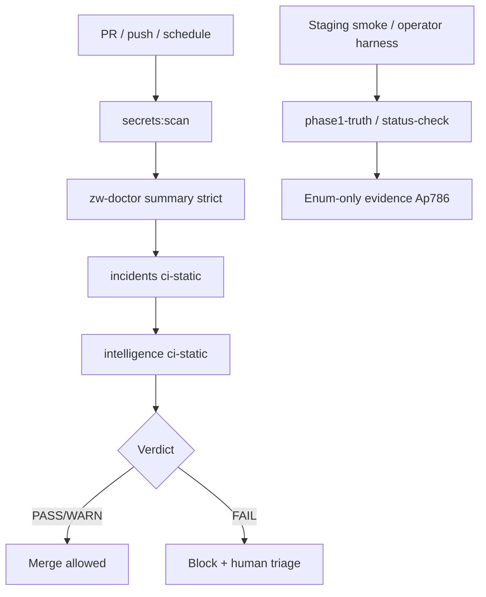

# Super-System failure detection and auto-repair report

**Date:** 2026-05-20  
**Window:** 2026-03-28 → 2026-05-20  
**Classification:** Detection **PARTIAL** · Auto-repair **PROPOSE-ONLY**  
**Sanitization:** No secrets; enum/boolean/count evidence only.

---

## 1. What the system can detect today

| Capability | Mechanism | CI-safe |
|------------|-----------|---------|
| Missing/malformed Stripe publishable key | zw-doctor invariants + intelligence | Yes |
| Live key in test context | `STRIPE_LIVE_KEY_IN_TEST_CONTEXT` | Yes |
| Wrong Vercel deploy root | invariant + assert script | Yes |
| Secrets in tracked sources | `secrets:scan` | Yes |
| Unpaid fulfillment drift | `RUNTIME_UNPAID_FULFILLMENT` invariant | Static / operator |
| Webhook/fulfillment duplicate risk | Incidents + L-4/L-5 evidence | Partial |
| Operator auth failure | `OPERATOR_AUTH_FAILED`, 401 | Staging probe only |
| Staging API down / HTML on API | route diagnostics, smoke | Staging |
| Incident taxonomy (21 types) | `zw-doctor incidents` | Yes (`--ci-static`) |
| Error classification | `zw-doctor intelligence` | Yes |
| Money path strict summary | `zw-doctor money-path` | Static |
| Self-healing apply attempted | Env scan in incidents | Yes |

**Post-merge read-only signals (operator attested):** `ACTIVE_INCIDENT_COUNT 0`, `ACTIVE_MONEY_INCIDENT_COUNT 0`, `FAIL_CLOSED_MONEY_PATH true`, `incident_verdict PASS`.

---

## 2. What it cannot detect yet

| Gap | Impact |
|-----|--------|
| Live production Stripe dashboard drift | Wrong webhook endpoint in prod |
| Neon branch mismatch without dashboard | Writes to wrong DB |
| Redis/BullMQ worker death mid-job | Stuck fulfillment (needs runtime metrics) |
| Cross-region latency SLO breach | Customer timeout |
| Fraudulent unpaid API probing at scale | Needs WAF/rate-limit analytics |
| L-13 duplicate refund until executed | Double-refund mirror unproven |
| Automatic Vercel rollback | Manual only |

---

## 3. Broken-server detection strategy

**Layers:**

1. **CI static** — no secrets, no money ops.  
2. **Integration tests** — Postgres in CI for money-path certification.  
3. **Staging operator** — human-in-loop; suffix-only enums.  
4. **Production** — not automated in repo; external monitoring TBD.

---

## 4. Safe failover strategy

| Failure | Safe response | Autonomous? |
|---------|---------------|-------------|
| API deploy root wrong | Redeploy `server/` root; zw-doctor detects | **No** — human deploy |
| Webhook handler 5xx | Stripe retries; idempotent handler | **No** auto env switch |
| DB unreachable | Fail closed; no fulfillment | **No** silent DB failover |
| Stripe key missing | Block checkout at edge | **Yes** (fail closed UI) |
| Operator token expired | Re-login harness | **No** |

**No silent failover** to alternate DATABASE_URL or payment provider without explicit change control.

---

## 5. Auto-repair boundaries

| Allowed (propose-only) | Forbidden without approval |
|------------------------|----------------------------|
| Document repair steps | DB UPDATE/DELETE |
| Classify incident severity | Migrations |
| Suggest npm commands (read-only) | Refund/payment API calls |
| Sanitized evidence capture | Webhook resend |
| Gitignore / CI wiring fixes | Vercel/Neon env edit |
| | `credential-rotation-execute` |
| | `ZW_SELF_HEALING_APPLY` money repairs |

**Existing code:** `selfHealingRunner`, `moneyPathDriftScan` — apply path **gated off** by default.

---

## 6. Why autonomous DB/env/payment mutation is forbidden

1. **Blast radius** — one wrong webhook resend can duplicate state.  
2. **Evidence discipline** — Ap786 requires human attestation for money proofs.  
3. **Regulatory/trust** — investor narrative requires fail-closed behavior.  
4. **Incident commander model** — agents propose; operators execute with approval phrases.

---

## 7. Recommended implementation phases

| Phase | Deliverable | Risk |
|-------|-------------|------|
| P1 | Merge audit pack + keep Guard green | Low |
| P2 | Frontend success/cancel investor routes | Low |
| P3 | Operator rotation dry-run PASS → execute (approved) | Medium |
| P4 | L-13 proof on staging branch | Medium |
| P5 | Production monitoring (Sentry/Datadog) suffix-only | Low |
| P6 | Self-healing **read-only** expanded diagnostics | Low |
| P7 | Self-healing apply (if ever) — separate security review | High |

---

## 8. KPIs (targets)

| KPI | Target | Current (honest) |
|-----|--------|------------------|
| **MTTD** (money incident) | < 15 min with Guard + incidents | **PARTIAL** — CI on PR; prod TBD |
| **MTTR** (money incident) | < 4 h human-led | **PARTIAL** — runbooks exist |
| Duplicate transaction count | **0** | **0** in L-4/L-5 proof scope |
| Unpaid fulfillment count | **0** | **0** in negative-path proofs |
| Active money incidents (ci-static) | **0** | **0** post-merge attested |
| Secret leakage in git | **0** | **0** (`secrets:scan` OK) |

---

## 9. Validation (this audit)

| Command | Expected |
|---------|----------|
| `zw-doctor incidents --ci-static` | No money mutation |
| `zw-doctor intelligence --ci-static` | `MONEY_MUTATION_EXECUTED false` |

Results recorded in `GLOBAL_ENGINEERING_HEALTH_REPORT_2026_05_20.md`.

---

*Autonomous repair not executed in this tranche.*
