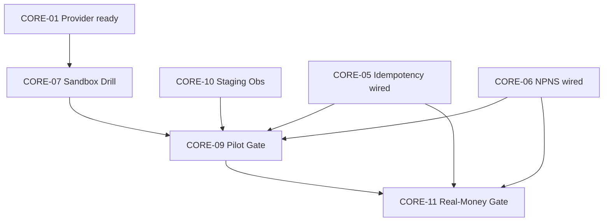

# CORE-12 Real-Money Blocker Map

**Date:** 2026-05-29  
**Scope:** Ap786 only · maps blockers from CORE-01..11 to real-money path · **real-money NOT APPROVED**  

---

## 1. Real-money path (logical)

```
Customer checkout (Stripe) → webhook slim path → order state → provider fulfill (Reloadly)
                              ↓                      ↓
                         idempotency              NPNS / audit
                         duplicate guard          wallet/settlement boundary
```

**No step in this map is approved for production real-money** per CORE-11 default **NO-GO**.

---

## 2. Blocker map (blocker → track → tier needed)

| Blocker ID | Description | CORE track | Register / doc | Tier to clear | Status |
|------------|-------------|------------|----------------|---------------|--------|
| RM-BLK-01 | Real-money gate not approved | CORE-11 | CORE11-REAL-MONEY-GONOGO-001 | `DOCS_ONLY` DR + `LIVE` EV | **BLOCKED** |
| RM-BLK-02 | CORE11-EV proof matrix incomplete | CORE-11 | [CORE11 proof matrix](./ZORA_WALAT_CORE11_REQUIRED_PROOF_MATRIX_2026_05_29.md) | `LIVE` | **PENDING** |
| RM-BLK-03 | Controlled pilot not approved | CORE-09 | CORE09-CONTROLLED-PILOT-001 | `STAGING` + DR | **BLOCKED** |
| RM-BLK-04 | Provider sandbox drill not executed | CORE-07 | CORE07 sandbox gate | `STAGING` | **NOT_EXECUTED** |
| RM-BLK-05 | Provider catalog not launch-verified | CORE-01 | CORE01 provider gaps | `STAGING` | **OPEN** |
| RM-BLK-06 | Sandbox boundary evidence pending | CORE-02 | CORE2-EV-* | `STAGING` | **PENDING** |
| RM-BLK-07 | Idempotency kernel not on live path | CORE-05 | [integration boundary](./ZORA_WALAT_CORE05_INTEGRATION_BOUNDARY_2026_05_29.md) | `STAGING`→`LIVE` | **NOT_WIRED** |
| RM-BLK-08 | NPNS proof not on live path | CORE-06 | [integration boundary](./ZORA_WALAT_CORE06_INTEGRATION_BOUNDARY_2026_05_29.md) | `STAGING`→`LIVE` | **NOT_WIRED** |
| RM-BLK-09 | Reliability invariants not runtime-verified | CORE-03 | state machine / FM docs | `STAGING` | **NOT_VERIFIED** |
| RM-BLK-10 | Staging observability not captured | CORE-10 | CORE10-STAGING-DOCTOR-OBS-001 | `STAGING` | **NOT_EXECUTED** |
| RM-BLK-11 | Financial control checklist incomplete | CORE-11 | financial boundary doc | `DOCS_ONLY`+ops | **PENDING** |
| RM-BLK-12 | Compliance / credential approval pending | CORE-11 | compliance checklist | signed approval | **PENDING** |
| RM-BLK-13 | Ops / incident / support gate not ready | CORE-11 | ops readiness gate | `LIVE` runbooks | **NOT READY** |
| RM-BLK-14 | Auto-repair apply disabled (required) | CORE-08 | apply boundary | N/A (must stay off until explicit apply gate) | **BY DESIGN** |
| RM-BLK-15 | CORE11-R-* risk register open items | CORE-11 | risk register | mitigation evidence | **OPEN** |

---

## 3. Dependency graph (simplified)



All nodes **BLOCKED** or **PENDING** as of 2026-05-29 unless separate execution evidence exists outside this pack.

---

## 4. Phrase gates (review vs execution)

| Phrase | Track | Authorizes |
|--------|-------|------------|
| `APPROVE CORE-07 RELOADLY SANDBOX DRILL ONLY` | CORE-07 | Sandbox drill only — **not** real-money |
| `APPROVE CORE-09 CONTROLLED PILOT GATE ONLY` | CORE-09 | Pilot gate review — **not** real-money |
| `APPROVE CORE-10 STAGING OBSERVABILITY GATE ONLY` | CORE-10 | Gate review — **not** capture |
| `APPROVE CORE-10 READ-ONLY STAGING SNAPSHOT CAPTURE ONLY` | CORE-10 | Read-only capture — **not** real-money |
| `APPROVE CORE-11 REAL-MONEY GO-NO-GO GATE ONLY` | CORE-11 | Gate review — **not** real-money execution |

**No phrase in CORE-01..11 authorizes real-money customer transactions** without separate execution approval and CORE11-EV PASS.

---

## 5. Alignment with production blocker register

| Register ID | Maps to RM-BLK |
|-------------|----------------|
| CORE11-REAL-MONEY-GONOGO-001 | RM-BLK-01, 02, 11–13, 15 |
| CORE09-CONTROLLED-PILOT-001 | RM-BLK-03 |
| CORE10-STAGING-DOCTOR-OBS-001 | RM-BLK-10 |
| CORE07 (sandbox drill gate) | RM-BLK-04 |
| CORE12-CORE-EVIDENCE-RECON-001 | Meta — does not clear RM-BLK |

---

## 6. Verdict

**Real-money: NO-GO** until RM-BLK-01..15 cleared per [CORE-11 entry criteria](./ZORA_WALAT_CORE11_GO_NO_GO_ENTRY_CRITERIA_2026_05_29.md) and [verdict](./ZORA_WALAT_CORE11_CONSERVATIVE_VERDICT_2026_05_29.md).

---

*End of blocker map.*
